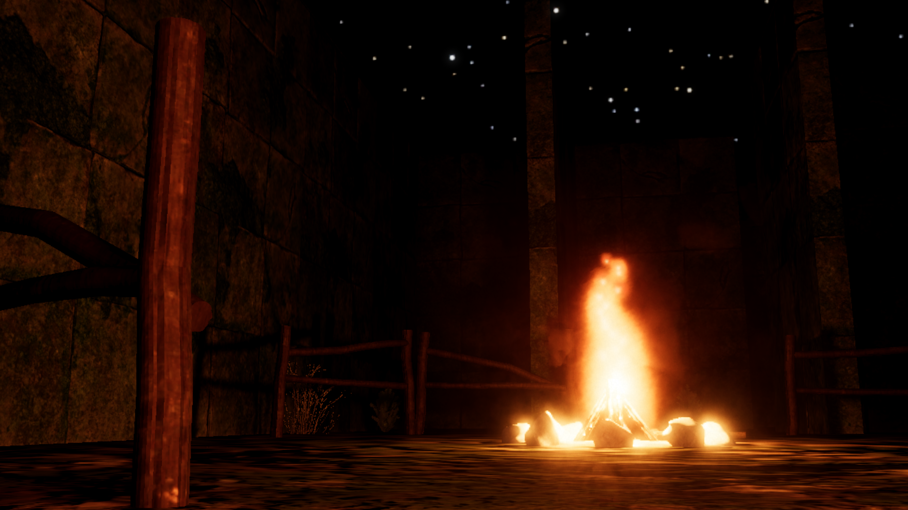
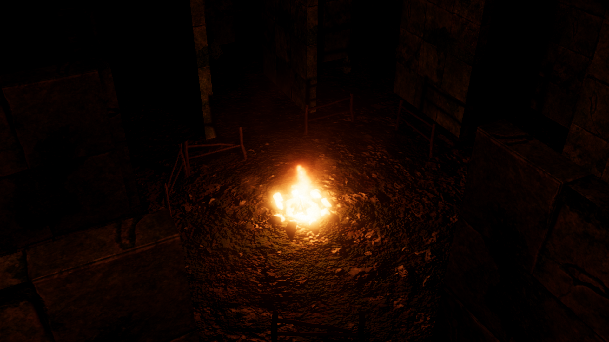
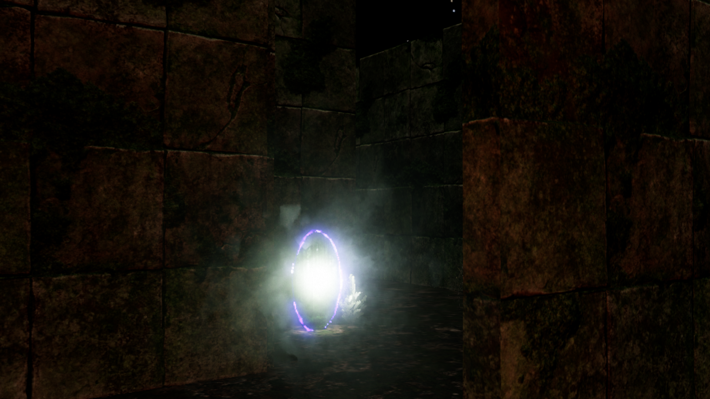
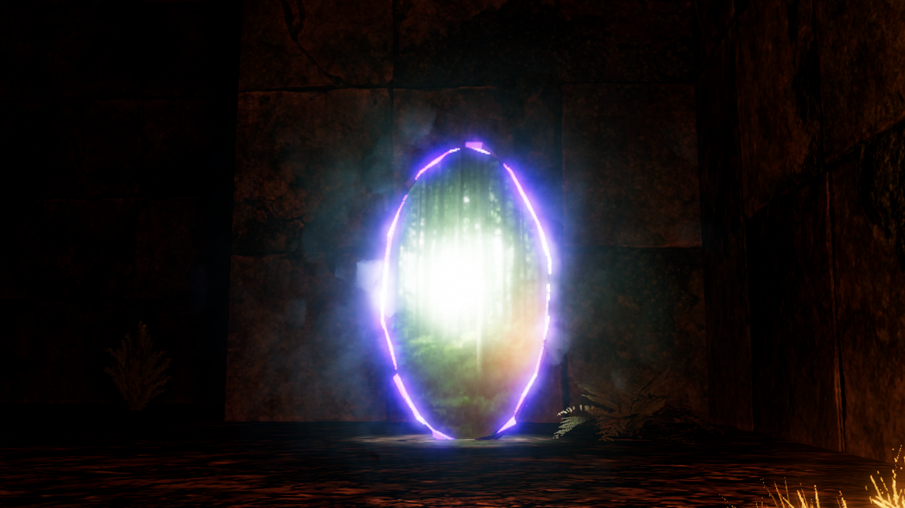
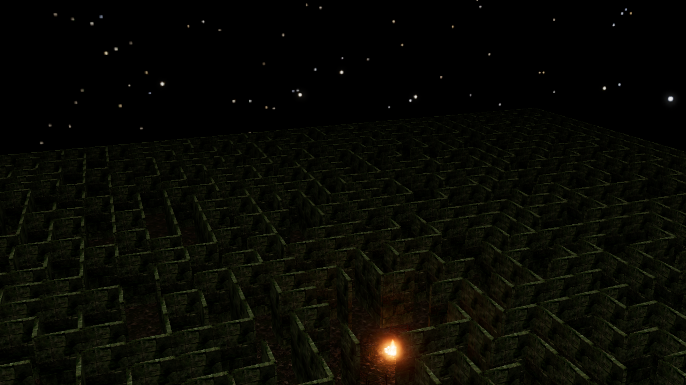
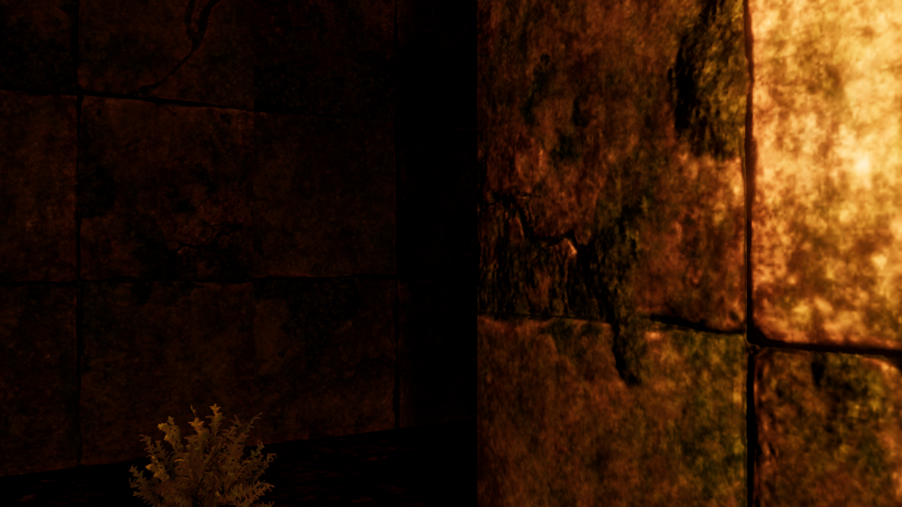

# UnderMaze
Escape Room Type game with randomly generated Maze

## Visual Representation

Check out some current visual elements and features of the project:

| Element | Description | View |
| :---: | :---: | :---: |
| **Campfire** | A close-up of the main light source and environment. |  |
| **Campfire Top View** | The campfire from a top-down, level-design perspective. |  |
| **Escape Portal (Lit)** | The environment with the portal fully charged and lit. |  |

---

| Element | Description | View |
| :---: | :---: | :---: |
| **Escape Portal (Unlit)** | The dormant, uncharged escape portal. |  |
| **Full Level Design** | An overview of a complete level structure. |  |
| **Shadow Casting** | A focus on dynamic lighting and shadow effects. |  |
